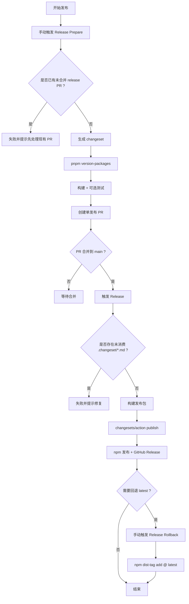

# 发布流程使用说明（单发布 PR + 自动 GitHub Release + 安全回退）

本文档说明当前仓库 npm 发包的标准流程，覆盖以下 3 条 GitHub Actions 工作流：

- `Release Prepare`：手动准备发布（生成 changeset + 立即升版 + 创建单发布 PR）
- `Release`：自动发布主流程（`push main` 触发，仅 publish）
- `Release Rollback`：手动回退 `latest` dist-tag

如果你要把本流程迁移到其他仓库，请参考：

- `.docs/release-migration-guide.md`

## 1. 发布目标与包白名单

当前仅支持以下发布包：

- `@adonis-kit/react-layouts`
- `@adonis-kit/ui`

> 说明：根目录 `package.json` 的 `"version": "0.0.0"` 是 monorepo 私有版本，不影响子包 npm 发布版本。

## 2. 一次性准备

在仓库 `Settings -> Secrets and variables -> Actions` 中配置：

- `NPM_TOKEN`：必须，具备 npm publish 和 dist-tag 修改权限
- `GITHUB_TOKEN`：GitHub Actions 自动注入（默认可用）
- `Settings -> Actions -> General -> Workflow permissions` 设为 `Read and write permissions`
- 勾选 `Allow GitHub Actions to create and approve pull requests`（`Release Prepare` 创建 PR 必需）

Changesets 配置必须包含以下两点：

1. 启用 changelog 生成（供 `version-packages` 与 `changesets/action` 使用）
2. 私有包不参与 version/tag（避免私有包误升版）

```json
{
  "changelog": "@changesets/cli/changelog",
  "privatePackages": {
    "version": false,
    "tag": false
  }
}
```

## 3. 工作流说明

### 3.1 `Release Prepare`（手动入口）

用途：你只需要选择包和版本级别，系统自动生成 changeset、执行升版，并创建一个可直接合并的发布 PR。

触发方式：GitHub Actions 手动运行 `Release Prepare`。

输入参数：

- `package`：`@adonis-kit/react-layouts` 或 `@adonis-kit/ui`
- `bump`：`patch` / `minor` / `major`（下拉选择）
- `summary`：changeset 说明（可选）

执行内容：

1. 检查是否已有未合并 release PR（有则直接失败，禁止并发）
2. 安装依赖
3. 执行发布配置校验：`node scripts/release/validate-changeset-config.mjs`
4. 自动生成 `.changeset/release-<pkg>-<runid>-<attempt>.md`
5. 立即升版：`pnpm version-packages`（消费 changeset，产出版本号与 changelog 变更）
6. 仅构建选中包：`pnpm turbo run build --filter=<package>`
7. 若选中 `@adonis-kit/react-layouts`，额外运行测试：`pnpm -C packages/react-layouts test`
8. 自动创建 PR（分支名：`release-prepare-<slug>-<runid>-<attempt>`）

### 3.2 `Release`（自动入口）

用途：在发布 PR 合并到 `main` 后，执行自动 npm publish，并创建 GitHub Release。

触发方式：`push` 到 `main`。

执行内容：

1. 检查 `.changeset/*.md` 残留（若存在未消费 changeset，直接失败并提示修复）
2. 安装依赖
3. 执行发布配置校验：`node scripts/release/validate-changeset-config.mjs`
4. 固定构建发布包（`@adonis-kit/react-layouts` 与 `@adonis-kit/ui`）
5. 执行 `changesets/action@v1`（仅 publish）：
   - `publish: pnpm release`
   - `createGithubReleases: true`

发布行为：

- 不再创建“二次版本 PR”
- 仅发布尚未发布的新版本，并自动生成 GitHub Release

### 3.3 `Release Rollback`（手动回退）

用途：失败后定向恢复某个包的 `latest` 指向，不做 unpublish。

触发方式：GitHub Actions 手动运行 `Release Rollback`。

输入参数：

- `package`：白名单包
- `restore_version`：要恢复为 `latest` 的已发布版本（如 `0.1.3`）

执行内容：

1. 校验版本号格式
2. 校验目标版本存在：`npm view <package>@<restore_version> version`
3. 记录回退前 dist-tags
4. 回退：`npm dist-tag add <package>@<restore_version> latest`
5. 记录回退后 dist-tags，并写入 workflow summary

## 4. 标准发布操作步骤（推荐）

1. 打开 GitHub Actions，运行 `Release Prepare`。
2. 选择要发布的包和 `patch/minor/major`，可填写 `summary`。
3. 等待自动创建 PR，确认改动中包含目标包的版本号与 changelog 更新。
4. 合并该 PR 到 `main`。
5. 等待 `Release` 自动执行 npm publish，并自动创建 GitHub Release。
6. 发布后验证：
   - `npm view @adonis-kit/react-layouts version`
   - `npm view @adonis-kit/ui version`

## 4.1 发布流程图（Mermaid）



图中关键判定点：

- `是否已有未合并 release PR`：保证单发布 PR 流程，不允许并发准备发布。
- `是否存在未消费 .changeset/*.md`：阻止绕过标准流程导致的状态漂移。
- `Release Rollback`：仅回退 `latest` dist-tag，不删除已发布版本。

## 4.2 `package.json` 发布脚本要不要手动执行？

当前脚本如下：

- `pnpm release`（`changeset publish`）
- `pnpm release:create-changeset`（`node scripts/release/create-changeset.mjs`）
- `pnpm release:detect-build-filters`（`node scripts/release/detect-build-filters.mjs`）
- `pnpm release:validate-config`（`node scripts/release/validate-changeset-config.mjs`）
- `pnpm version-packages`（`changeset version`）

结论（当前仓库默认流程）：

1. 日常发布不需要你手动执行这些命令。
2. 推荐入口是 GitHub Actions：手动跑 `Release Prepare`，审核并合并单发布 PR。
3. `Release` 工作流会自动执行发布必需步骤（包括校验、构建、publish、GitHub Release）。

各命令在当前流程中的定位：

| 命令 | 当前是否被 workflow 使用 | 你是否需要手动执行 |
| --- | --- | --- |
| `pnpm release` | 是。由 `Release` 中 `changesets/action` 调用（`publish: pnpm release`） | 通常不需要；仅在 CI 失效且你明确要本地直发时才考虑 |
| `pnpm version-packages` | 是。由 `Release Prepare` 调用，产出单发布 PR 的版本变更 | 通常不需要；仅在你要本地手工演练流程时使用 |
| `pnpm release:create-changeset` | 功能被 `Release Prepare` 使用（workflow 直接调用 `node scripts/release/create-changeset.mjs`） | 不需要，除非你要本地手工生成指定格式 changeset |
| `pnpm release:validate-config` | 是。被 `Release` 与 `Release Prepare` 使用（workflow 直接调用 `node scripts/release/validate-changeset-config.mjs`） | 不需要，可作为本地自检命令 |
| `pnpm release:detect-build-filters` | 否（当前 release workflow 未接入） | 不需要；属于预留/优化脚本 |

补充说明：

- 本仓库采用“保守稳定”策略：`Release` 固定构建 `@adonis-kit/react-layouts` 和 `@adonis-kit/ui`。
- `release:detect-build-filters` 目前不会影响实际发包结果。

## 5. 常见问题

### Q1：为什么看不到“版本 PR”？

这是新流程的预期行为。版本变更已在 `Release Prepare` 生成的单发布 PR 中完成，不再有二次版本 PR。

### Q2：`Release Prepare` 生成的 PR 没有版本号变化

通常是 `pnpm version-packages` 未执行成功，或 Changesets 配置异常。请查看 `Release Prepare` 日志中的 `Apply version changes` 步骤。

### Q3：`Release` 报错 `Found unconsumed changeset files`

说明 `main` 上存在未消费 `.changeset/*.md`。请走标准流程重新准备发布（生成并消费 changeset），不要直接把 changeset 文件合到 `main`。

### Q4：`Release` 成功但显示 `No unpublished projects to publish`

表示 npm 上没有待发布的新版本，这是正常现象。

### Q5：`Release Prepare` 报错 `GitHub Actions is not permitted to create or approve pull requests`

说明当前仓库（或组织）未允许 Actions 创建 PR。请开启：

- `Workflow permissions = Read and write permissions`
- `Allow GitHub Actions to create and approve pull requests`

## 6. 边界与约束

- 当前是单包选择发布（每次只准备一个包）
- 白名单仅包含两个包；新增包需同步更新 workflow 与脚本
- 回退只影响 npm `dist-tag`，不会回滚 Git 历史或代码
